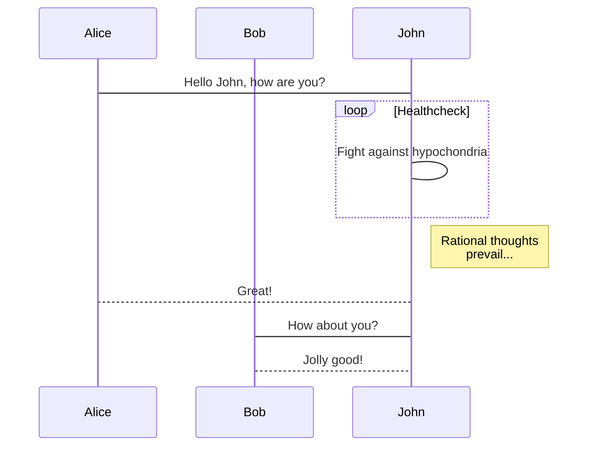

# PC - 工欲善其事，必先利其器。

## Mac

### Mac快捷键 - 全局快捷键

    显示各窗口：F3
    显示桌面： ⌘ + F3
    隐藏应用程序： ⌘ + H
    切换程序： ⌘ + tab
    切换程序内窗口： ⌘ + ～
    关闭程序： ⌘ + Q
    关闭程序内窗口： ⌘ + W
    全屏/取消全屏：⌃ + ⌘ + f
    新建一个窗口：⌘ + n

[桌面快捷键](http://blog.csdn.net/win_ann/article/details/3757987)


### OutLook - 邮件

```
在Alfred中打开Features->File Search即可。
```


### Chrome - 浏览器

#### Chrome快捷键

```
新标签页：⌘ + T
关闭标签：⌘ + W
```

```
登录Chrome账号，同步所有信息（标签、插件等）。
使用Alfred Web Bookmarks即可直接打开Chrome标签。
```


### Evernote - 笔记

```
登录Evernote账号，同步所有信息。
使用Alfred Evernote Workflows即可搜索到Evernote的笔记内容。
```


### 欧陆词典 - 翻译/屏幕取词

#### 快捷键

```
"激活Light Peek"的快捷键设置为： Shift + Space
```

#### 下载

[欧陆词典下载](https://www.eudic.net/v4/en/app/download)

#### 其他

	[Mac 有哪些好用的屏幕取词翻译工具？](https://www.zhihu.com/question/20461259)


### Alfred - 全局快捷工具

#### Alfred快捷键

```
Alfred HotKey: ⌘ + 空格
Alfred Snippets: ⌘ + G
Alfred Clipboard: ⌘ + J
Alfred Large Type: ⌘ + ⌥ + L （按HotKey之后，输入一段文字在输入框，再按Large Type，可全屏展示）

http://www.jianshu.com/p/e9f3352c785f
http://www.alfredworkflow.com
https://www.tanglei.name/blog/app-in-mac-preface.html
http://www.jianshu.com/p/98f53faabbff
```

#### Alfred购买

	[Alfred Mega 最多可使用4台机器](https://twitter.com/alfredapp/status/42596148074131456)
​	[Alfred Mega 如果在某台Mac上不再使用了，可使用deactivate来迁移License，忘了解绑的话也可发邮件到info@alfredapp寻求帮助 ](http://www.alfredforum.com/topic/2692-move-license-to-new-computer/)

	[MacTips 专栏：Alfred 3.0 Beta 之体验与授权种类选择](https://www.waerfa.com/37283)

#### Alfred配置

	[eof的Alfred配置](https://github.com/shmeof/eof_alfred)

#### AlfredWorkflow

	[Workflow市场](http://www.packal.org/)

	[[推荐]Workflows-List](http://www.packal.org/workflow-list)

	[Alfred-Workflows分享](https://www.alfredforum.com/forum/3-share-your-workflows/)

	[Alfred-Workflows：开发者的Workflows](https://github.com/willfarrell/alfred-workflows)

	[求推荐好的alfred workflow](https://www.v2ex.com/t/100651)

	[Workflow：网络标签](https://bbs.feng.com/read-htm-tid-11502455.html)

	[Copy URL | Packal](http://www.packal.org/workflow/copy-url)

	[六款提升操作效率的 Alfred Workflow_Pinapps_传送门](http://chuansong.me/n/2499436)

	[TKkk-iOSer/wechat-alfred-workflow: wechat workflow for Alfred：微信快速发送消息 & 打开聊天窗口 & 查看聊天记录](https://github.com/TKkk-iOSer/wechat-alfred-workflow) -- 推荐

	[让微信 macOS 客户端支持 Alfred | Sunnyyoung's Blog](https://blog.sunnyyoung.net/rang-wei-xin-macos-ke-hu-duan-zhi-chi-alfred/)

	[Wi-Fi Control | Packal](http://www.packal.org/workflow/wi-fi-control)

#### Alfred Workflow 开发

	[Python 新手也会写的 Alfred Workflow](https://toutiao.io/posts/uzbies/preview)

	[Alfred Workflow教程与实例 - 简书](https://www.jianshu.com/p/729d5f9991b8)

	[Welcome to Alfred-Workflow](http://www.deanishe.net/alfred-workflow/index.html)

	[alfred-workflow](https://github.com/deanishe/alfred-workflow) - 开发Workflow必看

	[为alfred编写workflow](https://www.jianshu.com/p/386ae7627608)

#### Alfred剪切板

	[Alfred Snippet - Alfred剪切板](https://www.alfredapp.com/extras/snippets/)
	[Alfred Snipped - 墨迹表情安装](http://joelcalifa.com/blog/alfred-emoji-snippet-pack/#install)

#### Alfred主题

	[Theme List](http://www.packal.org/theme-list)

#### Alfred其他

	[Alfred 3 中的惊喜](https://sspai.com/post/34344)

	[Alfred 效率神器全攻略](http://blog.surfacew.com/tool/2016/08/03/Alfred/)


### iTerm - Shell

####  iTerm快捷键

```
进入设置：command + ,
快速唤出：进入设置 -> Keys
垂直分割：command + d
水平分割：command + shift + d
删除一个单词：ctrl + w
删除当前行：ctrl + u
清屏：ctrl + l
双击：选中当前单词（选中即复制）
三击：选中当前行（选中即复制）
打开目录：执行(打开work目录)：open ~/Document/work
```

#### iTerm配置

	[mac－改造你的terminal](http://www.jianshu.com/p/bb1c97269b11)

	[Mac下终端配置（item2 + oh-my-zsh + solarized配色方案）](https://www.cnblogs.com/weixuqin/p/7029177.html)

	[使用iTerm2替代Mac自带Terminal终端](http://blog.csdn.net/chenyufeng1991/article/details/50492626)

	[Mac OS X 终端里使用 Solarized 配色方案](https://www.vpsee.com/2013/09/use-the-solarized-color-theme-on-mac-os-x-terminal/)

	[Mac下的效率工具autojump](http://www.barretlee.com/blog/2015/03/30/autojump-in-mac/)

	[关于“.bash_profile”和“.bashrc”区别的总结](http://blog.csdn.net/sch0120/article/details/70256318)

#### iTerm下使用ssh

	[mac用iterm2实现ssh，怎么像SecureCRT一样保存IP和账号密码？](https://www.zhihu.com/question/30640159?sort=created)

#### iTerm下使用SQLite

	cd到数据库文件"***.db"所在目录，执行：sqlite3 ***.db


### Vim - 编辑器之神

#### MacVim安装

	[MacVim安装及配置](https://www.jianshu.com/p/97d93fc72bcb)

#### Vim-Vundle：插件管理器

	[Vim插件管理——Vundle - DogeCoding - 博客园](https://www.cnblogs.com/DogeCoding/p/5435870.html)

#### Vim-Markdown：在Vim使用Markdown


### Emacs - 神的编辑器

[mac上spacemacs体验小记](http://www.cnblogs.com/pcy0/archive/2016/01/05/note-of-spacemacs-on-mac.html)


###  Typora - Markdown编辑器(所见所得)

#### Typora安装

	[Typora下载](https://typora.io/)

#### Typora主题

	[Typora主题下载](http://theme.typora.io/)

	[Typora如何安装主题](http://theme.typora.io/doc/) 推荐"Solarized"主题


#### Windows仿Alfred工具
方案1：未尝试
	Wox
		集成了Everything 
		不太成熟 	
		http://www.appinn.com/wox-launcher/
		http://www.getwox.com/
方案2：未尝试
	Launchy + Everything + Listary 
		呼出：alt+space 
方案3：未尝试
	Keypirinha 
方案4：未尝试
	altrun
方案5：未尝试
	Electron  

[win7左ctrl和左alt键互换 - 三更_雨 - 博客园](https://www.cnblogs.com/cyttina/p/3900929.html) -- 未尝试

#### Linux仿Alfred工具
方案1：未尝试
	krunner 


### Mermaid - Markdown画图（方便画图）

#### Mermaid安装

```
安装yarn：curl -o- -L https://yarnpkg.com/install.sh | bash
安装mermaid：yarn add mermaid 或 sudo yarn add mermaid
```

[Mermaid官网](https://mermaidjs.github.io)

[Mermaid在线画图](https://mermaidjs.github.io/mermaid-live-editor)

#### Mermaid使用

1、在Typora中输入以下内容

```
sequenceDiagram
    participant Alice
    participant Bob
    Alice->John: Hello John, how are you?
    loop Healthcheck
        John->John: Fight against hypochondria
    end
    Note right of John: Rational thoughts <br/>prevail...
    John-->Alice: Great!
    John->Bob: How about you?
    Bob-->John: Jolly good!
```

2、在输入区右下角“select a language”中，输入“mermaid”，即可展示图形（需要展示的工具支持，如Typora）。




#### Markdown工具对比

[Markdown 编辑器大对比 MacOSx](https://www.jianshu.com/p/39333840fdbf)


### NodePPT - Markdown写在线PPT

#### NodePPT快捷键

```
全屏：用Chrome打开演示文档，Chrome->视图->关闭"在全屏模式下始终显示工具栏"，Chrome->视图->进入全屏幕
O键：开启预览模式
H键：使特定文字闪动
N键：显示笔记备注
P键：调出画笔（调出画笔后，按B/Y/R/G/M，分别是画笔颜色 蓝/黄/红/绿/紫）
C键：清空画板

alt + 鼠标点击：放大／缩小点击处
```

#### NodePPT安装

```
npm install -g nodeppt
```

#### NodePTT创建

```
nodeppt create ppt名称

title: 演讲标题
subtitle：演讲子标题
speaker: 演讲者
```

### NodePTT预览

```
nodeppt start -p <未使用的端口>
nodeppt start -d <ppt所在目录>
```


[推荐nodeppt：使用markdown语法来写网页ppt](http://js8.in/2013/11/16/%E6%8E%A8%E8%8D%90nodeppt%EF%BC%9A%E4%BD%BF%E7%94%A8markdown%E8%AF%AD%E6%B3%95%E6%9D%A5%E5%86%99%E7%BD%91%E9%A1%B5ppt/)

[NodePPT GitHub](https://github.com/ksky521/nodeppt)

[NodePPT 演示Demo](http://js8.in/nodeppt/)

[NodePPT 演示Demo源文件](https://gitlab.com/mba811/nodePPT/blob/d3a97234a4fe2926b688862b54b4d7c24a5e90c8/ppts/demo.md)


### 素材获取

[图片视频素材](http://www.quanjing.com/)

[阿里图标库](http://www.iconfont.cn/collections)


### Git

#### Mac安装Git

	直接在Shell上运行：git


### GitHub

[MAC版GitHub配置SSH](https://blog.csdn.net/ShuTongIt/article/details/78902788)

[permission denied (publickey)问题的解决 和 向github添加ssh key - CSDN博客](https://blog.csdn.net/isunnyvinson/article/details/52598863)


### GitLab

[Gitlab使用第一篇；Mac下使用gitlab进行项目管理 - CSDN博客](https://blog.csdn.net/xunxianren007/article/details/54021499)


### GitHub & GitLab

[一台电脑同时使用GitLab和GitHub仓库 - CSDN博客](https://blog.csdn.net/KingBoyWorld/article/details/69221031?locationNum=1&fps=1)


### Gitbook - Git & Markdown & 写书

#### Gitbook安装

```
安装Node.js：https://nodejs.org/en/
安装Gitbook：sudo npm install gitbook-cli -g
验证安装结果：gitbook -V
使用Typora打开目录：Typora -> 文件 -> 打开
```

[Mac环境安装Gitbook，并导出PDF教程](https://www.jianshu.com/p/4824d216ad10)

[GitBook 简明教程](http://www.chengweiyang.cn/gitbook/index.html)

#### Gitbook常用命令

```
安装book.js中的插件：gitbook install
编译书籍：gitbook build
编译并发布书籍：gitbook serve
发生错误“spawn E2BIG”：npm rebuild
```

#### Gitbook插件Mermaid - 绘图

[使用mermaid-gb3插件绘图](https://plugins.gitbook.com/plugin/mermaid-gb3)

[错误：Error: spawn E2BIG](https://www.npmjs.com/package/gitbook-plugin-search-jieba)

#### Gitbook学习

http://gitbook.zhangjikai.com/plugins.html

#### Gitbook常用插件

http://zhaoda.net/2015/11/09/gitbook-plugins/

#### Gitbook发布到Centos6.9服务器

1.  安装nginx

2.  cd /usr/share/nginx/gitbook

3.  git clone https://git.gitbook.com/xxx/yyy.git

4.  拷贝目录"_book"路径，如：

    ```
    /usr/share/nginx/gitbook/yyy/_book
    ```

5.  在/usr/local/nginx目录创建目录"sites-enabled",添加文件"api_gitbook.conf",内容:

    ```
    server {
          listen 4000;
          server_name localhost;
          location / {
               root /usr/share/nginx/gitbook/wanzhouyi/_book;
               index index.html index.htm;
               try_files $uri $uri/ =404;
          }
    }
    ```

6.  在/usr/local/nginx/conf/nginx.conf中"http"项中添加一行:

    ```
    include /usr/local/nginx/sites-enabled/*.conf;
    ```

7.  重启nginx:

    ```
    service nginx restart
    ```

8.  在云服务器打开端口"4000"的配置

9.  访问：http://xxx.xxx.xxx.xxx:4000

10.  访问地址有端口，有点丑，可进行端口转发：https://www.cnblogs.com/zhaoyingjie/p/7248678.html

    参考：
    [centos用 yum 方式安装 nodejs 和 npm](http://blog.csdn.net/xiao_jun_0820/article/details/50838185)
    
    [使用gitbook 发布一个教程文档网站](https://www.cnblogs.com/engeng/p/8135437.html)	


### JDK - Java

	[Mac下如何安装JDK](http://www.cnblogs.com/quickcodes/p/5127101.html)


###  AndroidStudio - Android IDE

#### 安装

	[Android Studio Mac 下卸载与安装](http://www.jianshu.com/p/eb66c5132743)

	[为Android Studio设置HTTP代理](http://www.cnblogs.com/zl1991/p/6378060.html)

	[Android studio使用---WiFi ADB使用以及连接手机调试](http://blog.csdn.net/xiabing082/article/details/54376461)


#### 环境变量

[Mac下配置android环境变量 - CSDN博客](https://blog.csdn.net/jiangbo_phd/article/details/71440664)


#### NDK配置

	[AndroidStudio3.0开发调试安卓NDK的C++代码](http://blog.csdn.net/asmcvc/article/details/78690371)

	[Android studio调试卡死问题 no such host as localhost](http://blog.csdn.net/Kafka_88/article/details/53781602)

#### AS插件

	ButterKnife Zelezny：AS插件 自动插入View注解
	GsonFormat：自动生成Json Bean https://github.com/zzz40500/GsonFormat


### Stetho - Android调试工具

#### Stetho使用

Stetho：查看App的布局／网络请求抓包／数据库或sp文件查看／自定义dumpapp插件／对于JavaScript的支持

```
1、adb方式连接到设备
2、运行debug模式app
3、Chrome浏览器输入：chrome://inspect
4、选择需要inspect的应用进程
```

	[Stetho工具介绍](http://blog.csdn.net/u012455213/article/details/54099573)


### Gradle

#### Gradle安装

[Mac 配置gradle环境变量 - 简书](https://www.jianshu.com/p/e9d035f30876)

[Mac下配置Gradle环境 - CSDN博客](https://blog.csdn.net/u014005316/article/details/54927510)

[超详细之手把手配置 Mac 的path地址](https://mp.weixin.qq.com/s?__biz=MzI0Mzg1MjA2OQ==&mid=2247483711&idx=1&sn=553a649814b96ff23aafe12503e0f1d6&chksm=e967f775de107e631fde24b1dc0b932ca6cbce78747d0468ff6b90a53f02a357a18053895025&scene=21#wechat_redirect%20%E2%80%9C%E8%B6%85%E8%AF%A6%E7%BB%86%E4%B9%8B%E6%89%8B%E6%8A%8A%E6%89%8B%E9%85%8D%E7%BD%AE%20Mac%20%E7%9A%84path%E5%9C%B0%E5%9D%80%20%E2%80%9D)


#### Gradle依赖查看&可视化

#### 添加配置

[Android项目中的Gradle Task流程可视化](https://www.jianshu.com/p/6599de4cdcd1)

#### 查看

```
在build.gradle添加配置后，执行：
gradle <task 1>...<task N> taskTree --no-repeat
```

#### 可视化

```
在build.gradle添加配置后，执行：
dot -Tpng ./visteg.dot -o ./visteg.dot.png
```


### Maven

	[Mac下Maven安装与配置 - serena_uuu - 博客园](https://www.cnblogs.com/serena25/p/7110791.html)


### 微信开发者工具

[工具下载](https://developers.weixin.qq.com/miniprogram/dev/devtools/devtools.html)

[框架](https://developers.weixin.qq.com/miniprogram/dev/framework/structure.html)


###  Intellij Idea - IDE

	[IntelliJ IDEA（2017）下载并破解](http://blog.csdn.net/qq_27676247/article/details/74639304)

	[Iintellij Idea 注册码](http://idea.lanyus.com)


### PyCharm CE - Python IDE

	[PyCharm下载](https://www.jetbrains.com/pycharm/download/#section=mac)

	[pyCharm最新2018激活码 - CSDN博客](https://blog.csdn.net/u014044812/article/details/78727496)


### PhpStorm - Php IDE

```

```


###  Beyond Compare - 文件Diff

	[Beyond Compare下载](http://www.scootersoftware.com/download.php)


### Postman - 模拟发包工具

	[Postman下载](https://www.getpostman.com/apps)


### SQLiteManager - SQLite可视化

	[SQLiteManager下载](http://www.sqlabs.net/sqlitemanager.php) 注册码：SQLM3-29H3A-23383-LDCZD

	[SQLite官网](http://www.sqlite.org/)


### StartUML - UML建模

	[StartUML下载](http://staruml.io/download)

	[StartUML破解](http://blog.csdn.net/mergades/article/details/46662413)

	[错误处理：max connection attempts reached](https://my.oschina.net/youa)


	其他：

	UML画图

	StartUML

	PlantUML

	ArgoUML

	Google Drawings

	astah	


### OmniGraffle - 时序图流程图


### ProcessOn - 在线泳道流程图

	[ProcessOn](https://www.processon.com/)：支持模版


### Axure RP - 原型设计

	[AX8.0正式版_免费高速下载|百度网盘-分享无限制](https://pan.baidu.com/s/1nwmBHLv#list/path=%2F) 提取密码：ufnh

	[Axure RP 8最新激活码(可用注册码) - CSDN博客](https://blog.csdn.net/hejinde/article/details/54981845)


### Dr.Unarchiver - 压缩解压


### Paragon NTFS for Mac - Mac上写NTFS格式的移动硬盘

	[Paragon NTFS for Mac中文官网|Mac读写NTFS磁盘工具](http://www.ntfsformac.cn/)


## Windows

```
Vim / Spacemacs
	https://emacs-china.org/t/topic/2447/4
Notepadd++
EditPlus

Android Studio
IntelliJ IDEA Community Edition 2016.1.3
JetBrains PyCharm 2016.2.3
JetBrains PypStorm 2017.1
Eclipse

SecureCRT 8.1
WinSCP 
WireShark

Git
Subversion

SQLiteSpy
RegexBuddy 4 DEMO 4.1.3

Beyond Compare

Cmd Markdown
Evernote

Google Chrome
Mozilla Firefox

WinRAR

7-Zip

Skype for Business

Microsoft Office Word
Microsoft Office PowerPoint
Microsoft Office Excel
Microsoft Office Outlook
Microsoft Office Access

Skype for Business 2016

Enterprise Architect 8
Enterprise Architect 汉化版
  	
91助手
微信
QQ
```
